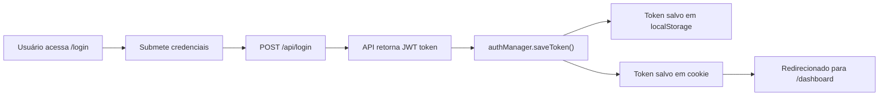
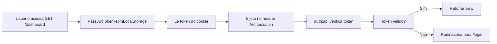
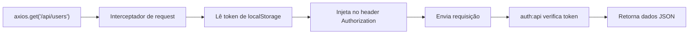

# Resumo da Implementação: Proteção de Rotas Web com JWT

## ✅ Implementação Completa

### Arquivos Criados/Modificados

#### 📁 Backend

| Arquivo | Status | Descrição |
|---------|--------|-----------|
| `app/Http/Controllers/Web/DashboardController.php` | ✅ Criado | Controlador que serve as views com proteção JWT |
| `app/Http/Middleware/CheckJwtToken.php` | ✅ Criado | Middleware para verificar token JWT |
| `app/Http/Middleware/HandleJwtExceptions.php` | ✅ Criado | Middleware para tratar exceções do JWT |
| `app/Http/Middleware/PassJwtTokenFromLocalStorage.php` | ✅ Criado | Middleware para passar token do cookie ao header |
| `bootstrap/app.php` | ✅ Modificado | Registra middlewares no container |
| `routes/web.php` | ✅ Modificado | Protege rotas web com `auth:api` |
| `config/auth.php` | ✅ Configurado | JWT é o guard padrão (`api`) |

#### 📁 Frontend

| Arquivo | Status | Descrição |
|---------|--------|-----------|
| `resources/js/auth.js` | ✅ Expandido | Classe `AuthManager` para gerenciar token |
| `resources/js/bootstrap.js` | ✅ Modificado | Interceptadores de axios para JWT |
| `resources/views/auth/login.blade.php` | ✅ Modificado | Usa `AuthManager` para armazenar token |

#### 📋 Documentação

| Arquivo | Status | Descrição |
|---------|--------|-----------|
| `JWT_PROTECTION_GUIDE.md` | ✅ Criado | Guia completo de implementação e troubleshooting |

---

## 🔐 Como Funciona

### 1️⃣ **Login do Usuário**



### 2️⃣ **Acesso a Rota Protegida (View)**



### 3️⃣ **Requisição AJAX/API**



---

## 🚀 Rotas Protegidas

### Rotas Web (Views)
```
GET  /login                      → Pública
GET  /                           → Redireciona para dashboard/login
GET  /dashboard                  → Protegida ✅
GET  /users                      → Protegida ✅
GET  /settings/roles             → Protegida ✅
GET  /settings/permissions       → Protegida ✅
```

### Rotas API
```
POST /api/login                  → Pública
POST /api/logout                 → Protegida ✅
GET  /api/me                     → Protegida ✅
GET  /api/users                  → Protegida + role:admin
GET  /api/users/{id}             → Protegida + role:admin
POST /api/users/registar         → Protegida + permission:create users
PUT  /api/users/{user}           → Protegida + permission:edit users
DELETE /api/users/{user}         → Protegida + permission:delete users
GET  /api/roles                  → Protegida + permission:manage roles
POST /api/users                  → Protegida + permission:create users
```

---

## 🔑 Classe AuthManager

### Funcionalidades

```javascript
// Instância global: window.authManager

// 1. Armazenar token
authManager.saveToken(token);

// 2. Obter token
const token = authManager.getToken();

// 3. Verificar se está autenticado
if (authManager.isAuthenticated()) { ... }

// 4. Fazer logout
authManager.logout();

// 5. Limpar token
authManager.clearToken();
```

### Sincronização Entre Abas

O sistema detecta mudanças no localStorage em diferentes abas:

```javascript
// Se fizer login em uma aba
// → Event 'storage' é disparado em outras abas
// → Token é sincronizado para o cookie
// → Outras abas agora têm acesso ao token
```

---

## 📝 Exemplo de Uso

### 1. Login

```javascript
// Em resources/views/auth/login.blade.php
document.getElementById('kt_sign_in_form').addEventListener('submit', async (e) => {
    e.preventDefault();
    
    const email = document.getElementById('email').value;
    const password = document.getElementById('password').value;
    
    try {
        const response = await axios.post('/api/login', { email, password });
        
        // Armazena token
        authManager.saveToken(response.data.access_token);
        
        // Redireciona
        window.location.href = '/dashboard';
    } catch (error) {
        toastr.error('Credenciais inválidas');
    }
});
```

### 2. Requisição Protegida (AJAX)

```javascript
// O interceptador do axios injeta o token automaticamente
const response = await axios.get('/api/users');
// Header enviado: Authorization: Bearer eyJ0eXAi...
```

### 3. Logout

```javascript
// Em qualquer lugar do código
window.logout(); // ou
authManager.logout();

// Faz logout na API
// Limpa token do localStorage
// Limpa cookie
// Redireciona para /login
```

---

## ⚙️ Configuração de Ambiente

### `.env`

```env
# Essencial para JWT
JWT_SECRET=seu_secret_aqui_com_caracteres_aleatorios
JWT_ALGORITHM=HS256
JWT_EXPIRE=3600  # 1 hora em segundos
```

### `config/auth.php`

```php
'defaults' => [
    'guard' => 'api',  // ✅ JWT é o guard padrão
    'passwords' => 'users',
],

'guards' => [
    'api' => [
        'driver' => 'jwt',  // ✅ JWT driver
        'provider' => 'users',
    ],
],
```

---

## 🧪 Testes de Segurança

### ✅ Teste 1: Acesso sem Token
```bash
curl http://localhost:8000/dashboard
# Resultado: Redirecionado para /login
```

### ✅ Teste 2: Token Inválido
```bash
curl -H "Authorization: Bearer invalid_token" \
  http://localhost:8000/dashboard
# Resultado: 401 Unauthorized
```

### ✅ Teste 3: Token Expirado
```bash
# Esperar mais de 1 hora (ou ajustar TTL)
curl -H "Authorization: Bearer expired_token" \
  http://localhost:8000/dashboard
# Resultado: Redirecionado para /login
```

### ✅ Teste 4: Token Válido
```bash
TOKEN="eyJ0eXAi..." # Token obtido no login
curl -H "Authorization: Bearer $TOKEN" \
  http://localhost:8000/dashboard
# Resultado: 200 OK com HTML
```

---

## 🐛 Troubleshooting

### Problema: "Não consigo acessar /dashboard"

**Solução**:
1. Certifique-se que fez login em `/login`
2. Verifique se o token foi armazenado: `localStorage.getItem('jwt_token')`
3. Verifique se o cookie foi criado: `document.cookie`
4. Verifique se o guard em `config/auth.php` é `api`

### Problema: "Token não é enviado nas requisições AJAX"

**Solução**:
1. Certifique-se que `resources/js/bootstrap.js` foi importado
2. Verifique se o interceptador está ativo
3. Cheque o Network tab do navegador para ver headers

### Problema: "Erro ao sincronizar token entre abas"

**Solução**:
1. O navegador precisa permitir cookies
2. Verifique se `SameSite=Strict` não está bloqueando
3. Teste em modo normal (não privado)

---

## 📚 Próximos Passos

1. **Refresh Tokens**: Implementar tokens de refresh para melhor segurança
2. **Rate Limiting**: Adicionar proteção contra força bruta
3. **2FA**: Implementar autenticação de dois fatores
4. **Audit Logging**: Registrar tentativas de login/logout

---

## 📞 Suporte

Para dúvidas, consulte:
- `JWT_PROTECTION_GUIDE.md` - Documentação técnica completa
- [Laravel JWT Auth](https://github.com/PHP-Open-Source-Saver/jwt-auth)
- [Laravel Middleware](https://laravel.com/docs/middleware)
